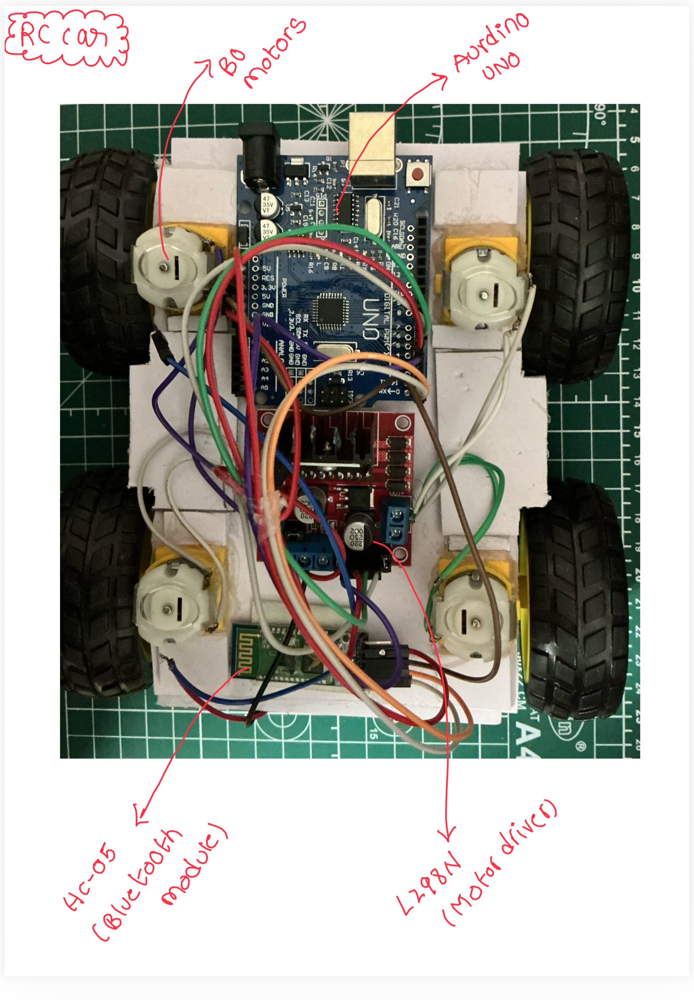

# Bluetooth-Controlled Robot Car

A 4-wheel drive (4WD) Bluetooth-controlled robot car developed using Arduino Uno, HC-05 Bluetooth module, and L298N motor driver. The vehicle can be controlled wirelessly through a smartphone application, enabling real-time directional movement.

## Overview

This project demonstrates the integration of embedded systems, wireless communication, and motor control. Commands sent from a mobile phone via Bluetooth are processed by the Arduino, which controls the motors through an L298N motor driver.

## Features

- Wireless Bluetooth control
- Forward movement
- Backward movement
- Left turn
- Right turn
- Stop functionality
- Real-time command processing
- 4WD drive system

## Hardware Components

| Component | Quantity |
|------------|------------|
| Arduino Uno | 1 |
| HC-05 Bluetooth Module | 1 |
| L298N Motor Driver | 1 |
| DC Geared Motors | 4 |
| Wheels | 4 |
| Li-ion 18500 Battery Cells | 2 |
| Chassis | 1 |

## System Architecture

Smartphone App
↓ Bluetooth
HC-05 Module
↓ Serial Communication
Arduino Uno
↓ Control Signals
L298N Motor Driver
↓
DC Motors

## Working Principle

1. User sends commands from a smartphone application.
2. HC-05 receives the Bluetooth command.
3. Arduino reads the command through serial communication.
4. Arduino generates control signals for the L298N motor driver.
5. Motor driver controls the four DC motors.
6. Vehicle performs the requested movement.

## Commands

| Command | Action |
|----------|----------|
| F | Forward |
| B | Backward |
| L | Left |
| R | Right |
| S | Stop |

## Project Image

## Future Improvements

- PWM-based speed control
- Obstacle avoidance using ultrasonic sensor
- Line-following capability
- ESP32 Wi-Fi control
- Mobile application development

## Author

Ishwar Nathani
B.Tech Electrical Engineering
IIT Bhubaneswar
